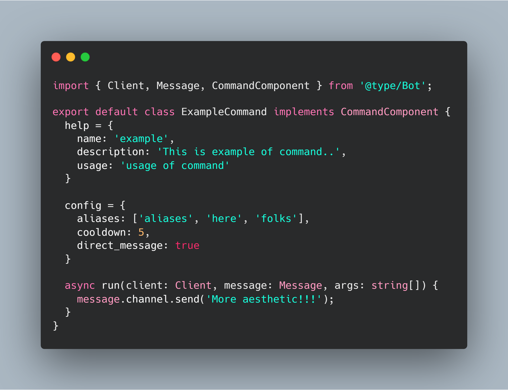

<h1 align="center">Discord-Template</h1>

<p align="center">
  <a href="#">
    
  </a>
  <a href='https://circleci.com/gh/skymunn/Discord-Template/'>
    
  </a>
  <a href='https://github.com/skymunn/Discord-Template/blob/master/LICENSE.md'>
    
  </a>
  <a href='https://github.com/skymunn/Discord-Template/blob/master/package.json'>
    
  </a>
</p>

<p align="center">
  
</p>

<p align="center">Discord Template that written in TypeScript, but you can make a command with ES6 too.</p>

*This documentation does not have an English version, but we will make it quickly.*

# Apa ini?
Discord-Template ini kegunaannya untuk kalian yang ingin membangun Discord agar lebih mudah dikarenakan semua fungsi penting yang biasanya telah diatur di awal pembuatan bot telah disediakan sedemikian rupa seperti Command Handler dan Event Listener.

Template ini ditulis dengan TypeScript akan tetapi anda dapat menggunakan JavaScript ES6 pada proyek ini karena kami menggunakan `ts-node` untuk mengcompile kode-kode ini. Adapun alasannya kami dapatkan dari [repositori aslinya](https://github.com/TypeStrong/ts-node#how-it-works) yakni:

> TypeScript Node works by registering the TypeScript compiler for .tsx? and .jsx? (when allowJs == true) extensions. When node.js has an extension registered (via require.extensions), it will use the extension internally for module resolution. When an extension is unknown to node.js, it handles the file as .js (JavaScript). By default, TypeScript Node avoids compiling files in /node_modules/ for three reasons:

> 1. Modules should always be published in a format node.js can consume
> 2. Transpiling the entire dependency tree will make your project slower
> 3. Differing behaviours between TypeScript and node.js (e.g. ES2015 modules) can result in a project that works until you decide to support a feature natively from node.js

> P.S. This means if you don't register an extension, it is compiled as JavaScript. When ts-node is used with allowJs, JavaScript files are transpiled using the TypeScript compiler.

Sehingga anda tidak usah takut apabila anda tidak bisa menggunakan TypeScript dan ini juga menjadi nilai tambah bagi template kami.

**Kami tekankan untuk untuk pemula agar mempelajari dasarnya dulu [di sini](https://anidiots.guide) dikarenakan command ini mempunyai beberapa fungsi yang lumayan aneh**.

# Berkontribusi Dalam Proyek Ini
Bebas, kami sangat terbuka untuk segala hal kontribusi. Kami juga sangat butuh bantuan yang membangun bagi kami, kalian, dan para pengguna template ini. Kami rasa proyek ini masih butuh beberapa hal fitur/perbaikan yang mungkin kami lewatkan.

Gunakan tab **Issues** untuk melaporkan/memberi ide kepada kami dan **Pull request** untuk memberikan beberapa sampel kalian agar kami uji coba sebagai fitur baru dari template ini.

# Hirarki Template
Dalam template ini mempunyai struktur aplikasi untuk menghandle keseluruhan sistem.
```
root@discord-template
  | .circleci
    Apabila anda menggunakan CircleCI, folder ini berisi
    command untuk menguji bot apakah layak linter atau tidak.
  | .vs
    Berisi setelan Visual Studio Code developer, tapi itu gaperlu,
    kalian bisa hapus folder ini.
  | node_modules
    Setelah kalian mengeksekusi npm install, kalian menemukan folder ini.
  | src
    Berisi main engine dari bot ini.
    | @types
      Berisi typing untuk TypeScript Definition untuk mengenalkan tipe untuk
      kode berbahasa TypeScript.
      Haram hukumnya dihapus.
    | assets
      Folder ini bebas kalian apain, intinya dalam folder ini merupakan 
      folder public/aset untuk bot kalian.
      Haram hukumnya dihapus.
    | commands
      Selain command, plugin, dan contoh template untuk command di bot kalian.
      Haram hukumnya dihapus.
    | environment
      Berisi mesin untuk menjalankan bot anda, di dalam folder tersebut terdapat plugin
      events yang berpatokan dengan folder sys.
      Haram hukumnya dihapus
    | dan beberapa file penting yang mungkin tidak perlu dijelaskan
```

# Cara Penggunaan
1. Clone repositori ini dan instal repositorinya.
```
git clone https://github.com/skymunn/Discord-Template.git
cd Discord-Template
npm install
```

2. Di dalam folder awal, ubah nama file `.env.example` menjadi `.env` kemudian isi token kalian
> Apabila anda mempunyai bot khusus developing, masukkan Tokennya juga di `TOKEN_DEV`. Apabila anda tidak mempunyai bot untuk developing, cukup masukkan token kalian 2 kali pada `TOKEN` dan `TOKEN_DEV`

3. Jalankan perintah `npm start` untuk memulai bot anda.
> Apabila anda ingin mengembangkan bot anda, disarankan agar menggunakan `npm run dev` dikarenakan template ini telah include dengan [nodemon](https://www.npmjs.com/package/nodemon) agar memudahkan dalam proses pengembangan.

# Menambahkan Command
1. Buka direktori `src/commands`.
2. Silahkan membuat kategori dahulu dengan cara membuat folder baru, dalam kasus ini nama folder tersebut adalah `core`.
   * Apabila anda hanya ingin menambahkan command dari kategori yang telah tersedia, silahkan loncat ke nomor 4.
3. Setelah anda membuat folder `core`, masuk dan buat file `module.json` yang berisi seperti berikut:
```json
{
  "name": "Core",
  "hide": false,
  "strict": []
}
```
*Karena JSON dilarang menggunakan command di dalamnya, saya jelaskan di bagian ini:*
* `name: string` = Menjelaskan nama kategori yang akan muncul di helper.
* `hide: boolean` = Berikan tanda true apabila kategori ini akan disembunyikan kepada member pada command help nanti.
* `strict: string[]` = Turunan langsung dari hide, apabila anda mengisi strict ini dengan ID server yang anda inginkan maka apabila command help dijalankan, maka penghuni server tersebut mengetahui isi command untuk command tersebut. Simpelnya, command special untuk server tertentu.

4. Buat file baru dengan nama yang anda inginkan, dalam kasus ini ialah `ItWorks.ts`. Kemudian isi file tersebut dengan standar penulisan kode template kami seperti di bawah:
```ts
// Untuk Typing, haram hukumnya anda require typing untuk digunakan sebagai
// pewarisan variabel. Typing di sini hanya digunakan sebagai penanda
// tipe data variabel.
//
// 3 variabel di bawah wajib hukumnya dipanggil.
import { Client, Message, CommandComponent } from '@type/Bot';

// Beda seperti Typing di atas, anda bisa mewariskan class untuk variabel
// lewat package discord.js di bawah ini.
//
// Ini opsional, sesuai kondisi.
import { RichEmbed } from 'discord.js'

// Nama file dan nama Class tidak boleh berbeda, ini untuk memudahkan
// bot untuk mengenal semua command dan memudahkan anda untuk mengembangkan
// bot anda kedepannya.
export default class ItWorks implements CommandComponent {
  // Di dalam object ini terdapat hal yang anda harus wajib atur untuk keperluan
  // help command.
  help = {
    // Dalam field name ini, di sini lah penginisalan command diatur.
    // Contohnya saya atur menjadi `works` sehingga di chat nanti,
    // command ini dapat dipanggil dengan cara <prefix>works.
    name: 'works',
    // Deskripsi tentang command ini.
    description: 'It works.',
    // Cara penggunaan command ini.
    usage: 'works'
  }

  config = {
    // Nama lain dari command ini. Penjelasan sama persis dengan static::help.name
    aliases: ['it', 'works'],
    // Cooldown dari command ini, defaultnya adalah 5 detik.
    cooldown: 5,
    // Menandakan bot ini apakah bisa dieksekusi lewat DM atau tidak.
    direct_message: true
  }

  // kalian tau lah isi ini apaan...
  async run(client: Client, message: Message, args: string[]) {
    let embed = new RichEmbed().setDescription('It works');
    message.channel.send(`<@!${message.author.id}>`, {embed: embed});
  }
}
```
*Ah iya, kami menyediakan template code/cheat sheet seperti ini di `src/commands/template`. Cek aja atuh*

# Lisensi
Template ini menggunakan lisensi GNU Affero General Public License v3.0. Apabila ada pelanggaran di dalamnya kami dapat menindak dengan tegas para pelanggar tersebut. Kode ini tertanda oleh `Ikramullah Latif <45F6D4DF8F571384>`.
